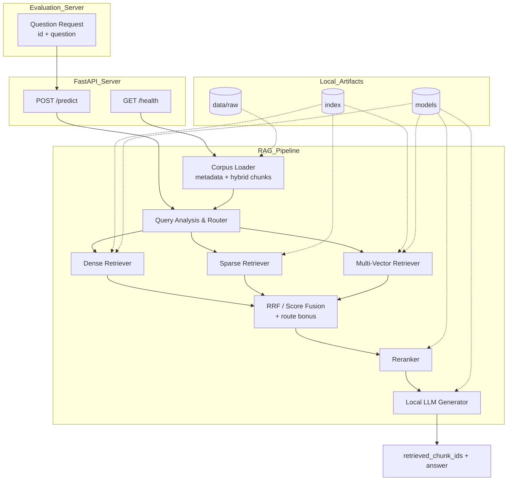

# ⚖️ FairData RAG: 공정위 의결서 기반 Retrieval-Augmented Generation System


**FairData RAG**는 공정거래위원회 FairData 공모전 Track 2 제출을 위해 구성한 **공정위 의결서 특화 하이브리드 RAG 시스템**입니다.
FastAPI 기반 `/health`, `/predict` 제출 API를 제공하며, 공정위 의결서 PDF/JSON 코퍼스를 대상으로 **dense retrieval + sparse retrieval + multi-vector retrieval + reranking + local LLM generation** 흐름을 수행합니다.

핵심 목표는 평가 서버가 전달하는 질문에 대해 다음 제출 규격을 안정적으로 만족하는 것입니다.

- 항상 코퍼스에 존재하는 `retrieved_chunk_ids` 5개 반환
- 검색 순위 기반 Recall@5 / MRR 개선
- 검색 근거를 바탕으로 답변 생성 품질 향상
- 인터넷이 차단된 평가 환경에서도 로컬 모델/인덱스로 동작

---

## 🧠 1. Architecture (아키텍처 소개)

본 프로젝트는 단일 검색 방식에 의존하지 않고, 질문 분석 결과에 따라 여러 retrieval path를 결합하는 구조입니다. 검색 후보를 fusion한 뒤 reranker로 재정렬하고, 최종 상위 청크를 로컬 LLM에 전달해 제출용 답변을 생성합니다.

### 💡 Core Components & Logic

- **FastAPI Submission Server**: `server.py`에서 `/health`, `/predict` 엔드포인트를 제공합니다. 평가 서버는 `/predict`에 `id`, `question`을 전달하고, 서버는 `id`, `retrieved_chunk_ids`, `answer`를 반환합니다.
- **Corpus Loader**: `data/raw/*_metadata.json`, `*_hybrid.json` 파일을 읽어 문서/청크 저장소를 구성합니다.
- **Query Router**: 질문의 주제, 초점, 법적 역할, 산업군, 기업 규모 등을 규칙 기반으로 분석하여 retrieval bonus와 경로 선택에 활용합니다.
- **Hybrid Retriever**: dense, sparse, multi-vector 검색 결과를 RRF 또는 score fusion으로 결합합니다.
- **Reranker**: 상위 후보 청크를 cross-encoder 계열 reranker로 재정렬합니다.
- **Local LLM Generator**: 최종 청크 5개를 근거로 답변을 생성합니다. 외부 API 호출 없이 로컬 모델 경로를 사용하도록 설계되어 있습니다.

### 📊 Model Flow Diagram



### 파이프라인 구성 요소 상세 설명

#### 🌐 Submission API

- `GET /health`: 코퍼스 청크 수, data 경로, 현재 retrieval profile, dense/sparse/multivector backend 정보를 반환합니다.
- `POST /predict`: 질문 1건을 받아 검색, 재정렬, 생성까지 수행한 뒤 제출 규격에 맞는 JSON을 반환합니다.

#### 🧭 Query Analysis & Router

`app/retrieval/router.py`와 `app/retrieval/pipeline.py`가 질문의 성격을 분석합니다. 분석 결과는 `theme`, `focus`, `legal_role`, `industry`, `company_size` 같은 태그로 표현되며, 청크의 route tag와 맞을수록 retrieval score에 보너스를 부여합니다.

#### 🔎 Hybrid Retrieval

현재 retrieval은 세 축으로 분리되어 있습니다.

- **Dense Retrieval**: 일반 임베딩 벡터 기반 검색. 예: `bgem3`, `e5`, `jina_v4`, `gte_multilingual`, `sbert`, `kure_v1`, `snowflake_ko`
- **Sparse Retrieval**: lexical sparse 또는 learned sparse 검색. 예: `bm25`, `bgem3 learned sparse`
- **Multi-Vector Retrieval**: 문서당 여러 벡터를 사용하는 late interaction 계열 검색. 현재 안정 경로는 `bgem3` family입니다.

#### 🧮 Fusion & Reranking

검색 경로별 후보를 `RRF` 또는 score fusion으로 합치고, route tag bonus를 더한 뒤 reranker가 최종 순서를 재조정합니다. 최종적으로 `/predict` 응답에는 정확히 5개의 `retrieved_chunk_ids`가 들어가야 합니다.

#### 🧠 Local Generation

`app/generation/generator.py`가 검색된 청크를 근거로 답변을 생성합니다. 기본 구조는 로컬 LLM 모델 디렉터리를 env로 지정하는 방식이며, 평가 환경의 offline 조건을 고려합니다.

---

## 📦 2. Data Setup (데이터셋 세팅 안내)

본 저장소는 공정위 의결서 원문 PDF와 전처리된 hybrid JSON / metadata JSON을 `data/raw/` 하위에 배치해 검색 코퍼스로 사용합니다.

### 🚨 데이터 및 산출물 관리 안내

- `data/raw/`: 검색 대상 원문 PDF, `*_hybrid.json`, `*_metadata.json`
- `data/test/`: 로컬 평가용 질의/정답 데이터셋
- `index/`: 검색 인덱스 산출물 저장 위치. 용량이 커질 수 있어 운영 환경에서 재생성/마운트하는 것을 권장합니다.
- `models/`: 임베딩, reranker, LLM 로컬 모델 저장 위치. 대형 모델 weight는 Git에 포함하지 않는 것을 권장합니다.
- `results/`: 실험 결과 산출물 저장 위치

인덱스는 `models/`가 아니라 `index/` 아래에 저장됩니다.

```text
index/
├── chroma_<namespace>/                         # dense index
├── sparse_<backend>_chunks_<model_tag>.npz     # sparse index
└── multivector_<backend>_chunks_<model_tag>*   # multi-vector index 또는 shard directory
```

각 인덱스는 manifest와 corpus fingerprint를 비교하여 기존 인덱스를 재사용하거나, corpus 변경 시 재생성합니다.

---

## 3. 📂 Project Structure (디렉토리 구조)

```text
skn25-fairdata-competition        # 📦 FairData RAG 제출 코드 루트
│
├── app/                          # 🧠 Core RAG Modules
│   ├── evaluation/               # 로컬 평가 지표 계산
│   ├── generation/               # 로컬 LLM 기반 답변 생성
│   ├── preprocessing/            # raw/hybrid 코퍼스 로드
│   ├── rerank/                   # reranker interface/backend/runtime
│   ├── retrieval/                # dense/sparse/multi-vector retrieval pipeline
│   └── utils/                    # config, schema, text utility
│
├── data/                         # 📁 Corpus & Evaluation Data
│   ├── raw/                      # 공정위 의결서 PDF + hybrid/metadata JSON
│   └── test/                     # 로컬 평가셋
│
├── docs/                         # 📄 공모전 가이드 및 실험 문서
├── cache/                        # 🧭 route tag 등 재사용 캐시
├── index/                        # 🗄️ 검색 인덱스 산출물
├── models/                       # 🤖 로컬 모델 디렉터리
├── results/                      # 📊 실험 결과
│
├── scripts/                      # 🛠️ Build / Server / Evaluation Scripts
│   ├── build_indexes.py          # dense/sparse/multi-vector index build
│   ├── build_route_tags.py       # route tag 생성
│   ├── evaluate_local.py         # 제출 API 기준 로컬 평가
│   ├── v2_e0_build.sh            # V2-E0 index build wrapper
│   ├── v2_e0_server.sh           # V2-E0 server wrapper
│   ├── v2_e0_eval.sh             # V2-E0 evaluation wrapper
│   └── exp_v2_*.sh               # retrieval 조합별 실험 스크립트
│
├── Dockerfile                    # 🐳 최종 제출/실행용 Docker build
├── requirements.txt              # 📚 최종 실행/제출용 Python dependencies
├── download_models.py            # ⬇️ 모델 다운로드 helper
└── server.py                     # 🚪 FastAPI API entrypoint
```

---

## 🚀 4. Quick Start (설치 및 시작 가이드)

### Option A: Local Python Environment (가상환경)

`uv` 사용을 권장하지만, 일반 `venv + pip` 환경에서도 실행할 수 있습니다.

```bash
# 1. 저장소 클론
git clone https://github.com/kimdappi/skn25-fairdata-competition.git
cd skn25-fairdata-competition

# 2. 가상환경 생성 및 활성화
python3 -m venv .venv
source .venv/bin/activate

# 3. 의존성 설치
pip install -r requirements.txt
```

`uv`를 사용할 경우:

```bash
python3 -m venv .venv
source .venv/bin/activate
pip install uv
uv pip install --no-cache -r requirements.txt --index-strategy unsafe-best-match
```

### Option B: Docker Container

제출 환경과 최대한 유사하게 격리 실행하려면 Docker를 사용합니다.

```bash
# 기본 이미지 빌드
docker build -t fairdata-rag:latest .

# API 서버 실행 예시
docker run --rm --gpus all -p 8000:8000 fairdata-rag:latest
```

---

## 5. Supported Modes (명령어 사용법)

초기 세팅 시에는 모델 준비 → 인덱스 구축 → 서버 실행 → 로컬 평가 순서로 확인하는 것을 권장합니다.

### 🏗️ Phase 1: Model Preparation (모델 준비)

필요한 임베딩/reranker/LLM 모델을 `models/` 하위에 배치합니다. 일부 helper script가 제공됩니다.

```bash
# BGE-M3 모델 다운로드 helper
bash scripts/download_bgem3_model.sh

# 여러 모델 조합 다운로드 helper
bash scripts/download_model_matrix.sh
```

모델 경로는 `app/utils/config.py`의 env 해석 함수와 `FAIRDATA_*_MODEL_DIR` 환경변수로 제어합니다.

### 🧱 Phase 2: Index Build (검색 인덱스 구축)

```bash
# 기본 index build
python -u scripts/build_indexes.py

# V2-E0 wrapper 사용
bash scripts/v2_e0_build.sh
```

대표 환경변수:

```bash
export FAIRDATA_ENABLE_DENSE=1
export FAIRDATA_ENABLE_SPARSE=1
export FAIRDATA_ENABLE_MULTIVECTOR=1
export FAIRDATA_DENSE_BACKEND=bgem3
export FAIRDATA_SPARSE_BACKEND=bgem3
export FAIRDATA_MULTIVECTOR_BACKEND=bgem3
export FAIRDATA_EXPERIMENT_TAG=V2-E0
```

### 🌐 Phase 3: API Server Start (`/health`, `/predict`)

```bash
# 직접 uvicorn 실행
PYTHONPATH=$PWD python -m uvicorn server:app --host 0.0.0.0 --port 8000

# V2-E0 wrapper 사용. 기본 포트는 8100
bash scripts/v2_e0_server.sh
```

상태 확인:

```bash
curl -fsS http://127.0.0.1:8000/health | python -m json.tool
```

단일 smoke test:

```bash
curl -sS -X POST http://127.0.0.1:8000/predict \
  -H 'Content-Type: application/json' \
  -d '{"id":"demo-1","question":"한국계란유통협회의 위반 사실과 처분 내용을 설명해 주세요."}' \
  | python -m json.tool
```

### 🔬 Phase 4: Local Evaluation (로컬 평가)

```bash
# 서버가 먼저 떠 있어야 합니다.
python -u scripts/evaluate_local.py \
  --eval-file data/test/eval_dataset_260505.json \
  --base-url http://127.0.0.1:8000 \
  --results-dir results/local \
  --experiment-tag local-test \
  --timeout 120

# V2-E0 wrapper 사용
bash scripts/v2_e0_eval.sh
```

평가 결과는 `results/` 하위에 저장되며, 주요 비교 지표는 다음과 같습니다.

- `recall_at_5`
- `mrr`
- `token_f1`
- `bertscore_f1`
- `final_score`

### ⚙️ Phase 5: Retrieval Experiment Modes

대표 retrieval profile은 아래와 같습니다.

- `dense_only`
- `dense_lexical_hybrid`
- `dense_learned_sparse_hybrid`
- `full_hybrid`
- `custom`

실험용 shell script는 `scripts/exp_v2_*.sh`와 `scripts/run_*.sh`에 정리되어 있습니다. 예시는 다음과 같습니다.

```bash
# BGEM3 dense + sparse 계열 실험
bash scripts/exp_v2_e2_bgem3_dense_sparse.sh

# GTE dense + BM25 hybrid 실험
bash scripts/exp_v2_e4_gte_bm25.sh

# 요청된 V2 실험 순차 실행
bash scripts/run_requested_v2_experiments_sequential.sh
```

---

## 6. Configuration Reference (주요 환경변수)

| 구분 | 환경변수 | 설명 |
| --- | --- | --- |
| Retrieval | `FAIRDATA_ENABLE_DENSE` | dense retrieval 활성화 |
| Retrieval | `FAIRDATA_ENABLE_SPARSE` | sparse retrieval 활성화 |
| Retrieval | `FAIRDATA_ENABLE_MULTIVECTOR` | multi-vector retrieval 활성화 |
| Backend | `FAIRDATA_DENSE_BACKEND` | dense backend 이름 |
| Backend | `FAIRDATA_SPARSE_BACKEND` | sparse backend 이름 |
| Backend | `FAIRDATA_MULTIVECTOR_BACKEND` | multi-vector backend 이름 |
| Rerank | `FAIRDATA_RERANK_BACKEND` | reranker backend 이름 |
| Fusion | `FAIRDATA_USE_RRF_FUSION` | RRF fusion 사용 여부 |
| Runtime | `FAIRDATA_DENSE_DEVICE` | dense model device |
| Runtime | `FAIRDATA_RERANK_DEVICE` | reranker device |
| Runtime | `FAIRDATA_LLM_DEVICE` | LLM device |
| Experiment | `FAIRDATA_EXPERIMENT_TAG` | 결과 저장/비교용 실험 태그 |

일반 dense 모델(`e5`, `jina_v4`, `gte_multilingual`, `sbert`, `kure_v1`, `snowflake_ko`)은 `dense-only` 또는 `dense + bm25` 조합으로 운영하는 것이 안전합니다. Learned sparse와 multi-vector는 현재 구현상 `bgem3` family 중심으로 검증되어 있습니다.

---

## 📄 7. License (라이선스)

본 저장소는 공정거래위원회 FairData 공모전 Track 2 실험/제출을 위한 프로젝트입니다. 데이터, 공모전 자료, 모델 weight의 사용 조건은 각 원천 제공처와 공모전 운영 규정을 따릅니다.
