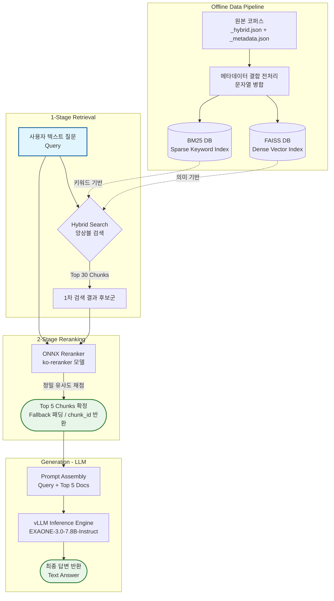
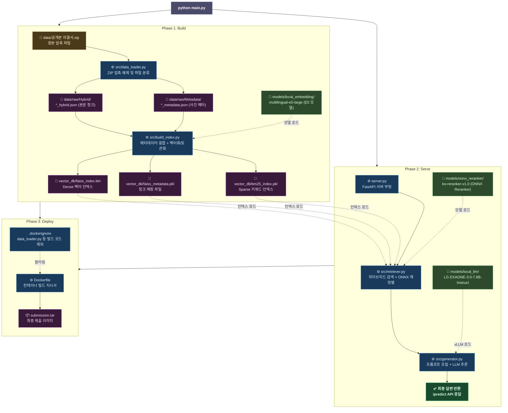

# **🏆 제2회 공정위 AI·데이터 활용 공모전: 오프라인 RAG 파이프라인**

본 프로젝트는 공정거래위원회 의결서 코퍼스(Corpus)를 기반으로 **기업 법무 컴플라이언스 리스크를 실시간으로 모니터링하고 질의응답하는 RAG(검색 증강 생성) 챗봇 시스템**을 구축한 결과물입니다.

주최측의 엄격한 기술적 제약 조건(완전 오프라인 환경, 8B 이하 모델, 30초 이내 응답)을 통과하기 위해 **메타데이터 융합 전처리**, **ONNX 경량화**, **vLLM 메모리 최적화** 기술을 전면 도입하였습니다.

## **🚀 핵심 기술 및 차별점 (Technical Edge)**

1. **메타데이터 융합 하이브리드 검색 (Context Enrichment)**  
   * 긴 의결서의 청크 단절(Context Loss) 문제를 해결하기 위해, `_metadata.json`의 '위반유형', '피심인기업명'을 `_hybrid.json`의 본문 텍스트 앞에 강제 융합하여 의미 기반(FAISS) + 키워드 기반(BM25) 1차 검색의 정확도(Recall)를 극대화했습니다.  
2. **ONNX Reranker를 통한 2차 정밀 재정렬**  
   * PyTorch 모델 대신 ONNX Runtime으로 양자화/경량화된 ko-reranker를 사용하여 연산 속도를 1.5배 이상 끌어올리고 GPU 의존도를 낮춰(CPU 가동) MRR 점수와 속도를 동시에 확보했습니다.  
3. **vLLM 기반 초고속 생성 및 GPU 메모리 튜닝 (OOM 방지)**  
   * A100/RTX3090 (24GB) 단일 GPU 환경에서 임베딩 모델(2.6GB)과 EXAONE 7.8B 모델(15GB)이 충돌 없이 공존할 수 있도록, vLLM의 gpu_memory_utilization을 **0.85** 비율로 튜닝하여 30초 타임아웃을 방어했습니다.

## **🏗️ 시스템 아키텍처 및 워크플로우**



## **📁 프로젝트 디렉토리 구조**

프로젝트는 모듈화 및 책임 분리 원칙에 따라 설계되었으며, main.py를 통해 통합 관리됩니다.
(⭕: docker에 포함, ❌: docker에 포함되지 않음)

```
rag_project/  
├── data/                       # ❌ 원본 데이터 저장소  
│   ├── raw/                    # ❌ 압축 해제된 원본 데이터  
│   └── 공개본 의결서.zip       # ❌ 주최측 제공 원본 파일  
├── models/                     # ⭕ 오프라인 모델 가중치 (Image 포함)  
│   ├── local_embedding/        # ⭕ multilingual-e5-large  
│   ├── local_llm/              # ⭕ EXAONE-3.0-7.8B-Instruct  
│   ├── onnx_reranker/          # ⭕ ko-reranker (ONNX)  
│   └── vector_db/              # ⭕ 사전 구축된 오프라인 인덱스 (Image 포함)  
│       ├── bm25_index.pkl      # ⭕ Sparse 키워드 인덱스  
│       ├── faiss_index.bin     # ⭕ Dense 벡터 인덱스  
│       └── faiss_metadata.pkl  # ⭕ 청크 메타데이터 매핑 파일  
├── src/                        # ⭕ 핵심 알고리즘 모듈 (Source)  
│   ├── build_index.py          # ❌ FAISS 및 BM25 벡터 인덱스 생성
│   ├── data_loader.py          # ❌ 공개본 의결서.zip 압축 풀기
│   ├── generator.py            # ⭕ vLLM 프롬프트 조립 및 생성 엔진
│   ├── preprocessor.py         # ❌ 메타데이터-청크 융합 전처리
│   └── retriever.py            # ⭕ 하이브리드 검색 및 ONNX 재정렬
├── .dockerignore               # ❌ Docker 빌드 필터
├── Dockerfile                  # ❌ Docker 빌드 지시서
├── export_onnx.py              # ❌ Reranker 모델 ONNX 변환 유틸
├── main.py                     # ⭕ 프로젝트 전체 통합 컨트롤러
├── requirements.txt            # ⭕ 패키지 의존성 목록
├── server.py                   # ⭕ FastAPI 기반 최종 추론 서버
└── README.md                   # ❌ 프로젝트 개요서
```

### **🔄 파이프라인 파일 생성 및 구동 흐름 (Pipeline Flow)**

프로젝트는 크게 **[Phase 1] 데이터 사전 구축**과 **[Phase 2] 추론 서버 구동** 두 단계로 나뉘어 파일들을 순차적으로 생성하고 실행합니다. 모든 과정은 `main.py`가 중앙에서 오케스트레이션(통제)합니다.



#### **Phase 1: 데이터 사전 구축 (Data Ingestion & Indexing)**
데이터베이스 구축 명령어(`python main.py --build`) 실행 시 다음 순서로 파일이 생성됩니다.
1. **`src/data_loader.py` 실행**:
   - 주최측이 제공한 `data/공개본 의결서.zip` 파일을 읽어 압축을 해제합니다.
   - **[생성됨]** `data/raw/Hybrid/` (`_hybrid.json` 청크 파일들)
   - **[생성됨]** `data/raw/Metadata/` (`_metadata.json` 메타데이터 파일들)
2. **`src/build_index.py` 실행** (내부적으로 `src/preprocessor.py` 활용):
   - `models/local_embedding/` 폴더에 저장된 로컬 임베딩 모델을 로드합니다.
   - 방금 생성된 `data/raw/` 파일들을 읽어와 본문 텍스트와 메타데이터를 병합 처리합니다.
   - 융합된 텍스트를 바탕으로 벡터 임베딩 및 형태소 토큰화 작업을 수행합니다.
   - **[생성됨]** `vector_db/faiss_index.bin` (Dense 벡터 인덱스)
   - **[생성됨]** `vector_db/faiss_metadata.pkl` (원본 텍스트 매핑 파일)
   - **[생성됨]** `vector_db/bm25_index.pkl` (Sparse 키워드 인덱스)

#### **Phase 2: 추론 서버 구동 (Serving & Inference)**
사전 구축된 파일들을 바탕으로 추론 서버(`python main.py --serve`) 구동 시 파이프라인이 전개됩니다.
1. **`server.py` 구동**:
   - FastAPI 서버가 열리며 런타임 메모리에 대용량 LLM 모델을 적재합니다.
2. **검색 모듈 (`src/retriever.py`)**:
   - 사용자 질문이 접수되면 Phase 1에서 만든 `vector_db/` 인덱스 3종을 읽어 1차 하이브리드 검색을 수행합니다.
   - 이어서 `models/onnx_reranker/`의 모델을 로드해 속도 저하 없이 2차 정밀 재정렬(Reranking)을 완료합니다.
3. **생성 모듈 (`src/generator.py`)**:
   - 검색된 문서를 모아 프롬프트를 구성하고, `models/local_llm/`의 거대 언어 모델(vLLM 기반)에 주입하여 최종 답변 텍스트를 생성 및 반환합니다.

#### **Phase 3: 오프라인 배포 패키징**
- 파이프라인 구동에 필수적인 `models/`, `vector_db/`, `src/` 디렉토리와 코드들을 대상으로 `Dockerfile`을 실행합니다.
- 용량이 큰 원본 압축 파일(`data/공개본 의결서.zip` 등)은 `.dockerignore`의 규칙에 따라 제외되고, 오프라인 망 구동에 필요한 파일들만 컨테이너 내부로 복사되어 최종 제출 환경을 완성합니다.

## **💻 실행 및 빌드 가이드 (How to run)**

본 프로젝트는 주최측 폐쇄망 평가 환경을 고려하여 **단일 터미널 명령어**만으로 모든 파이프라인이 구동되도록 설계되었습니다.

### **1. 로컬 통합 테스트 (main.py CLI)**

```
# 전체 실행 (데이터베이스 구축부터 서버 오픈까지 논스톱)  
python main.py --all

# Phase 1: 데이터 압축 해제 및 FAISS/BM25 인덱스 구축 (최초 1회 필수)  
python main.py --build

# Phase 2: 인덱스 구축 생략, 즉시 모델 메모리 적재 및 서버 구동 (개발 시 자주 사용)  
python main.py --serve
```

### **2. FastAPI 모의고사 테스트**

서버 구동 후, 별도의 터미널 창에서 아래 API 규격에 맞춰 테스트를 진행합니다. (응답 시간 30초 제한 방어 확인)

```
curl -X 'POST' \  
  'http://localhost:8000/predict' \  
  -H 'Content-Type: application/json' \  
  -d '{  
  "question": "건설기계개별연명사업자협의회의 부당한 공동행위는 어떤 것들이 있나요?"  
}'
```

### **3. 최종 제출용 Docker 패키징**

오프라인망 평가 채점 시스템에 업로드하기 위한 최종 압축본 생성 과정입니다.

```
# 1. 20GB에 달하는 모델과 DB를 포함하여 도커 이미지 빌드  
docker build -t rag-submission:latest .

# 2. 오프라인 모의고사 (네트워크 차단 상태에서 구동 테스트)  
docker run -d --name rag-test --network none --gpus all -p 8000:8000 rag-submission:latest

# 3. 제출물 tar 파일 추출  
docker save rag-submission:latest -o submission.tar  
```